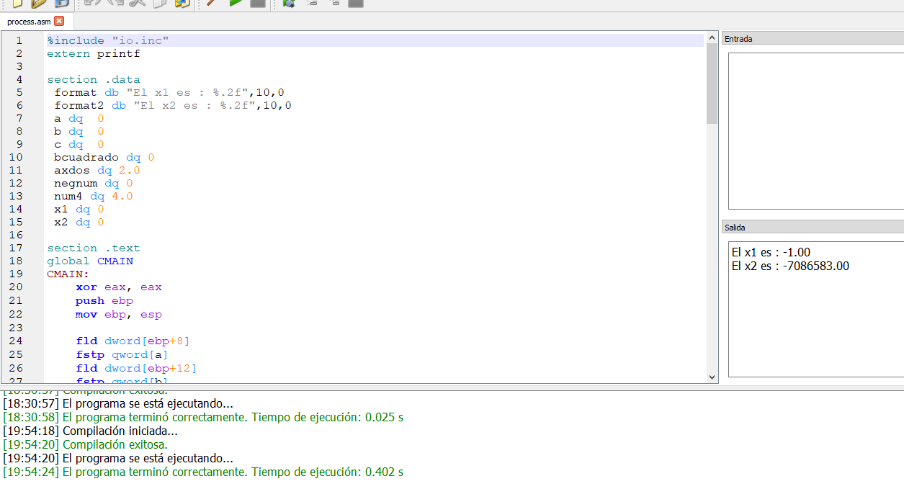
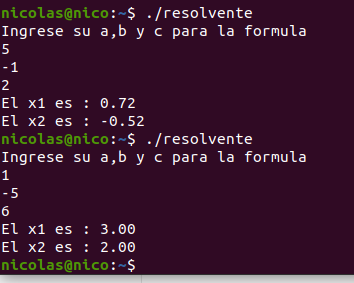

# Tp-Orga
-El programa resolvente te va a pedir un a, b y c donde la a tiene que ser > 0 sino te tira un mensaje aclarandolo.
-En el asm va cargando el a b y c pasados por c a la pila de fpu y haciendo las cuentas que se necesiten para reslver 
la formula.
-En orga.c mandamos los numeros al asm restringiendo que a sea > 0.

 
 
